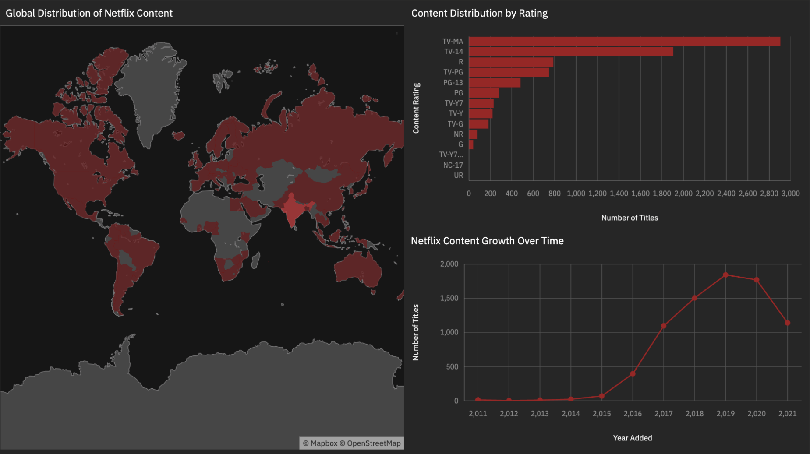
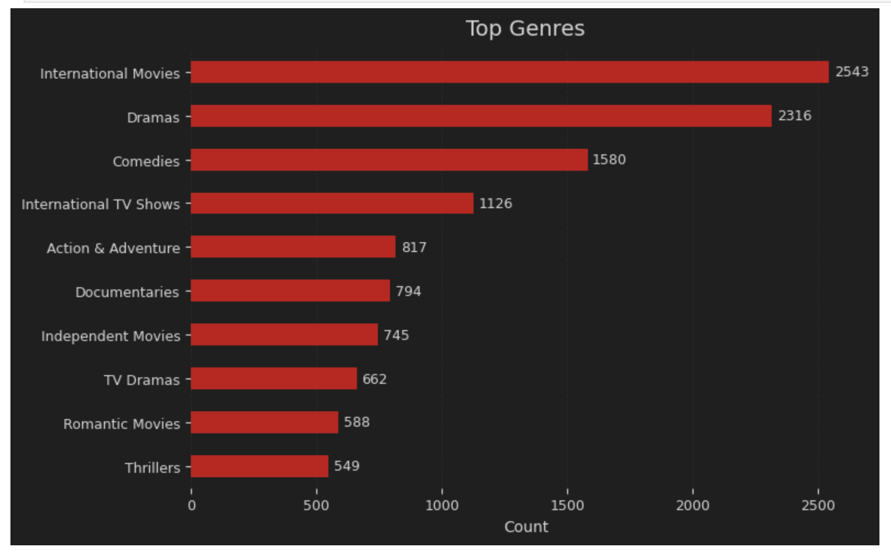
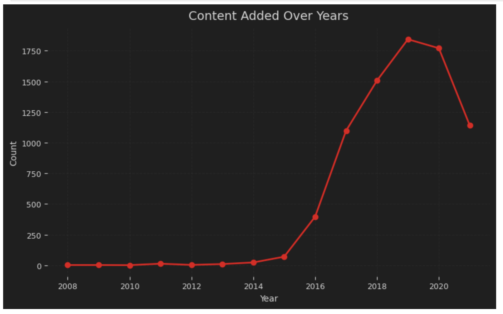
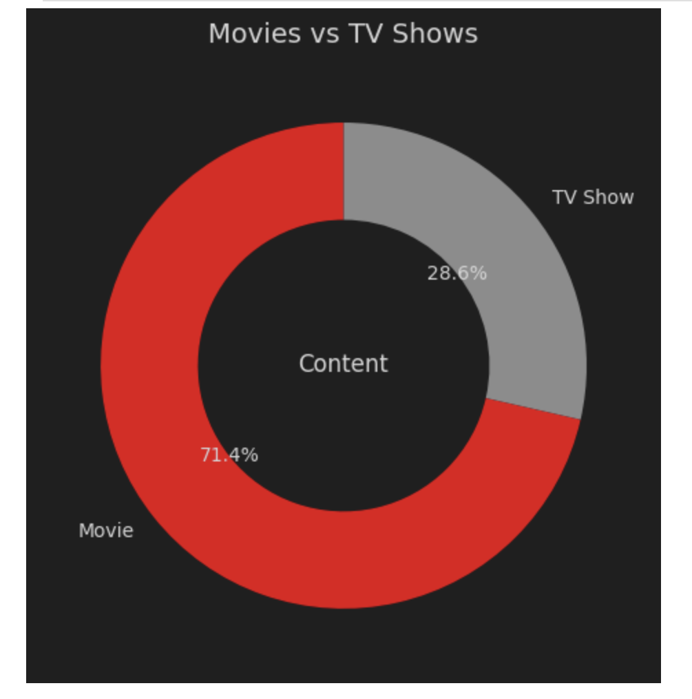
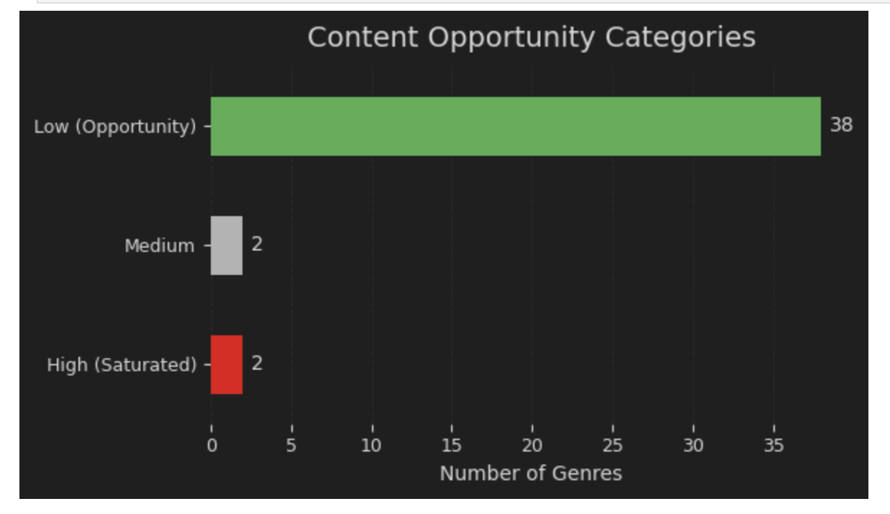

# Netflix Content Analysis

Netflix Content Analysis is a data analytics project focused on exploring Netflix movies and TV shows using Python, cleaned CSV data, dashboard visuals, and business insights.

The project analyzes content type, release trends, country distribution, ratings, genres, and platform-level catalog patterns to understand how Netflix content is structured and how the platform has evolved over time.

## Live Demo

Not deployed. This project is presented through a Jupyter Notebook, cleaned dataset, dashboard PDF, dashboard images, and an insights file.

## Preview

### Dashboard Screens

| Netflix Dashboard | Type Distribution |
|---|---|
|  |  |

| Release Trends | Country Insights |
|---|---|
|  |  |

| Final Dashboard View |
|---|
|  |

### Dashboard Report

The project also includes a full dashboard/report export:

```text
netflix_dashboard.pdf
```

## Project Highlights

- Analyzes Netflix movies and TV shows.
- Uses cleaned Netflix catalog data.
- Explores content type distribution between Movies and TV Shows.
- Analyzes release year trends and platform content growth.
- Studies country-wise content availability.
- Reviews ratings, genres, and catalog patterns.
- Includes a Jupyter Notebook for Python-based analysis.
- Includes dashboard PNG images for quick visual review.
- Includes a dashboard PDF for report-style presentation.
- Includes an insights markdown file for key findings.
- Suitable for Data Analyst and Business Intelligence fresher portfolios.

## Tech Stack

- Python
- Pandas
- Matplotlib
- Seaborn
- Jupyter Notebook
- CSV
- Data Cleaning
- Data Analysis
- Data Visualization
- Dashboard Reporting
- PDF Dashboard

## Dataset

The included cleaned dataset is:

```text
netflix_cleaned (1).csv
```

The dataset contains Netflix catalog information such as content type, title, country, release year, rating, duration, genre/listed category, and related metadata.

## Main Files

```text
netflix.ipynb                Jupyter Notebook with analysis workflow
netflix_cleaned (1).csv      Cleaned Netflix dataset
netflix_dashboard.pdf        Dashboard report/export
netflix.png                  Main dashboard image
Insights.md                  Key insights and observations
README.md                    Project documentation
s2.png                       Dashboard screenshot
s3.png                       Dashboard screenshot
s4.png                       Dashboard screenshot
s6.png                       Dashboard screenshot
```

## Analysis Approach

The project follows a standard data analytics workflow:

```text
Load cleaned Netflix dataset
        ↓
Review dataset structure and columns
        ↓
Clean and prepare data for analysis
        ↓
Analyze Movies vs TV Shows distribution
        ↓
Explore release year and content growth trends
        ↓
Analyze country-wise content contribution
        ↓
Study ratings, genres, and duration patterns
        ↓
Create dashboard visuals
        ↓
Export dashboard/report
        ↓
Summarize insights for business interpretation
```

## Main Features

### Netflix Catalog Analysis

The project studies Netflix's content library and identifies trends in movies, TV shows, ratings, countries, genres, and release years.

### Content Type Breakdown

The analysis compares the distribution of Movies and TV Shows to understand the platform's content mix.

### Release Trend Analysis

The project explores how Netflix content has grown over time and highlights release-year patterns.

### Country and Genre Insights

The analysis identifies major content-producing countries and commonly occurring content categories.

### Dashboard Reporting

The repository includes `netflix_dashboard.pdf` as a final dashboard report and PNG images for quick preview.

### Insights Summary

The `Insights.md` file contains key findings and observations from the analysis.

## Project Structure

```text
Netflix-Content-Analysis/
├── Insights.md
├── README.md
├── netflix.ipynb
├── netflix.png
├── netflix_cleaned (1).csv
├── netflix_dashboard.pdf
├── s2.png
├── s3.png
├── s4.png
└── s6.png
```

## Setup

Clone the repository:

```bash
git clone https://github.com/aishidutta13/Netflix-Content-Analysis.git
cd Netflix-Content-Analysis
```

Install required Python libraries:

```bash
pip install pandas matplotlib seaborn jupyter
```

Open the notebook:

```bash
jupyter notebook netflix.ipynb
```

## How To View The Dashboard

View the dashboard images directly in the README:

```text
netflix.png
s2.png
s3.png
s4.png
s6.png
```

Or open the full dashboard PDF:

```text
netflix_dashboard.pdf
```

## Example Use Cases

- Netflix catalog analysis
- Movies vs TV Shows comparison
- Content release trend analysis
- Country-wise content analysis
- Genre and rating analysis
- Data analyst portfolio project
- Business intelligence dashboard practice
- Exploratory data analysis practice
- Entertainment data analytics

## Current Limitations

- The project is not deployed as an interactive dashboard.
- Dashboard interactivity is limited because the final output is exported as PDF/images.
- The analysis depends on the available cleaned dataset.
- More detailed statistical analysis can be added in future versions.
- SQL-based analysis can be added for stronger analyst portfolio value.

## Future Improvements

- Add interactive dashboard using Power BI, Tableau, Streamlit, or Plotly Dash.
- Add SQL queries for Netflix catalog analysis.
- Add more detailed business recommendations.
- Include additional screenshots from the notebook.
- Add charts directly inside the README.
- Add an executive summary section.
- Deploy an interactive version publicly.

## Author

Aishi Dutta

GitHub: [aishidutta13](https://github.com/aishidutta13)
